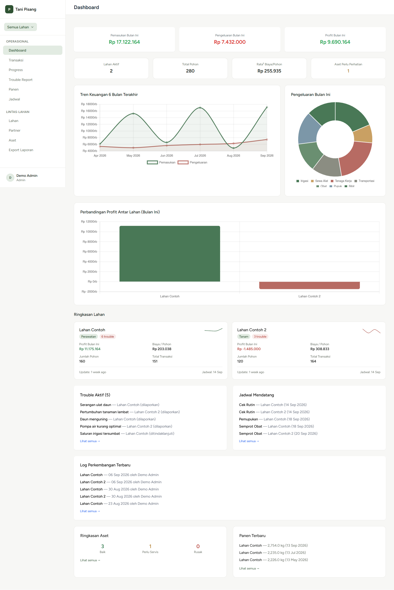
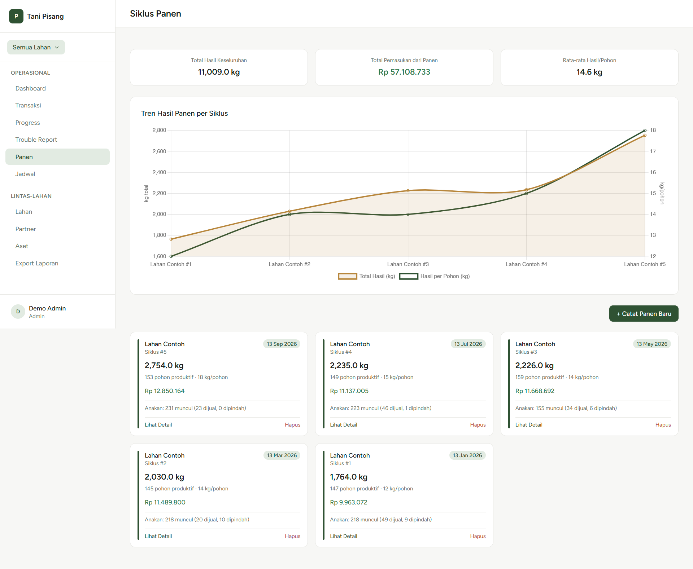

# 🍌 Tani Pisang — Sistem Manajemen Kebun Pisang Cavendish

> **Aplikasi manajemen usaha tani pisang Cavendish berbasis web**, dibangun khusus untuk mengelola operasional kebun nyata milik pribadi — mulai dari pencatatan keuangan, pemantauan *progress* lahan, pelaporan masalah, pengelolaan siklus panen, hingga laporan konsolidasi untuk evaluasi usaha.

⚠️ **Catatan Privasi:** Aplikasi ini sedang aktif digunakan untuk operasional bisnis nyata dan berisi data finansial pribadi, sehingga tidak dibuka untuk akses publik. *Source code* tersedia di sini untuk keperluan portofolio dan dapat dijalankan secara lokal dengan data contoh — lihat bagian [Instalasi Lokal](#-instalasi-lokal).

---

## 📌 Latar Belakang

Proyek ini lahir dari kebutuhan nyata di lapangan: mengelola usaha tani pisang Cavendish yang melibatkan kemitraan tiga pihak (pemodal/pengelola, penyedia bibit sekaligus pembeli, dan pemilik lahan). 

Tantangan unik dalam bisnis ini meliputi:
* **Skema kepemilikan lahan yang beragam** (sistem sewa vs bagi hasil).
* **Siklus panen pisang yang spesifik** — jumlah pohon produktif berubah tiap siklus karena sistem anakan (tunas) yang dipangkas untuk dijual, dipindahkan ke lahan lain, atau dijadikan pupuk.

Kebutuhan spesifik inilah yang membuat aplikasi generik (*spreadsheet* atau software akuntansi umum) kurang optimal, sehingga dibangun sistem khusus yang memodelkan alur bisnis ini secara langsung.

---

## ✨ Fitur Utama

* 🌳 **Manajemen Lahan ("Lahan-First"):** Setiap lahan berdiri mandiri dengan datanya sendiri, memudahkan *switch* antar lahan tanpa tercampur.
* 💰 **Keuangan:** Pencatatan transaksi lengkap dengan dukungan transaksi non-kas (bibit hibah, anakan yang dipindah dengan nilai estimasi).
* 📈 **Progress Tracking:** Log perkembangan lahan berkala disertai foto untuk pemantauan jarak jauh.
* 🛠️ **Trouble Report:** Pelaporan masalah operasional dengan alur status (`Dilaporkan` → `Ditindaklanjuti` → `Selesai`) beserta riwayatnya.
* 🍌 **Panen & Anakan:** Pencatatan tiap siklus panen dengan *tracking* nasib anakan (dijual sebagai bibit / dipindah ke lahan lain / dijadikan pupuk).
* 🤝 **Partner & Kesepakatan:** Pengelolaan mitra dengan sistem *versioning* kesepakatan (riwayat kesepakatan lama tetap tersimpan saat direvisi).
* 🚜 **Aset:** Pencatatan aset (seperti pompa air) dengan alokasi penggunaan lintas lahan.
* 📅 **Jadwal & Reminder:** Penjadwalan perawatan berulang lengkap dengan riwayat pelaksanaannya.
* 🔐 **Role-Based Access Control (RBAC):** Pemisahan hak akses yang jelas antara **Admin** (pemilik) dan **Staff** (tim lapangan).
* 📊 **Dashboard & Visualisasi:** Grafik tren keuangan, perbandingan antar lahan, dan ringkasan aset menggunakan Chart.js.
* 📄 **Export Laporan PDF:** Pembuatan laporan konsolidasi untuk evaluasi berkala.

---

## 🛠️ Tech Stack

* **Backend:** Laravel 11
* **Frontend:** Blade, Alpine.js, Tailwind CSS
* **Database:** MySQL
* **PDF Generation:** `barryvdh/laravel-dompdf`
* **Charting:** Chart.js
* **Authentication:** Laravel Breeze

---

## 📸 Screenshot

*(Screenshot menyusul — lihat folder `docs/screenshots/`)*

```markdown
<!-- Contoh penempatan screenshot nantinya: -->
<!--  -->
<!--  -->
<!--  -->
---
🚀 Instalasi Lokal
Untuk menjalankan aplikasi ini di komputer lokal Anda menggunakan data contoh (dummy data):
```bash
# 1. Clone repository
git clone https://github.com/AliMasykur10/Tani-Pisang.git
cd Tani-Pisang

# 2. Install dependencies (PHP & Node.js)
composer install
npm install

# 3. Setup environment file
cp .env.example .env
php artisan key:generate

# 4. Konfigurasi database di file .env, lalu jalankan migrasi & seeder
php artisan migrate --seed

# 5. Buat symlink storage untuk upload foto
php artisan storage:link

# 6. Jalankan development server
php artisan serve
npm run dev
```
Setelah server berjalan, buka `http://localhost:8000`, lakukan registrasi akun baru, lalu ubah role akun tersebut menjadi admin melalui Tinker:
```bash
php artisan tinker
```
```php
$user = App\Models\User::where('email', 'emailkamu@example.com')->first();
$user->role = 'admin';
$user->save();
```
---
## 🤖 Catatan Transparansi


Aplikasi ini dibangun dengan bantuan Claude AI (Anthropic) sebagai asisten pemrograman — mulai dari diskusi arsitektur, penulisan kode, hingga debugging saat deployment.


Sebagai kreator, peran saya meliputi mendefinisikan kebutuhan bisnis, mengambil keputusan desain (design decisions), melakukan testing menyeluruh, dan menyelesaikan proses deploy ke production secara mandiri.


Saya membagikan proyek ini secara terbuka karena percaya bahwa transparansi proses kerja sangat penting di era modern, di mana AI telah menjadi bagian normal dari alur kerja developer (sama seperti dokumentasi, Stack Overflow, atau kolaborasi antar-engineer).


---
📄 Lisensi


Proyek pribadi untuk keperluan operasional usaha tani sendiri.